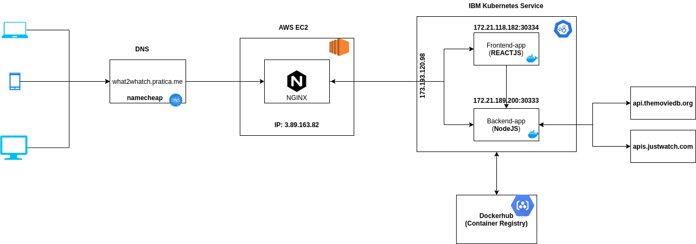

# Streaming Recommendations Platform - What2Watch

## Overview
This project is part of hackathon from INF-332 made by team-7.

Our purpose is to provide the best movie, series and tv's platform recommendation for everyone and ofcourse, for free.

Check it out [here](http://what2watch.pratica.me/)

## The Stack
We love all programming language without discrimination, but the way. For instance we choose javascript frameworks ( *NodeJS & ReactJS* ) to enhance the team performance and also to speed up prototype and create a MVP always focusing on javascript simplicity.

## Architecture
We love microservices and all the approach behind it and we believe in Docker and Kubernetes. 
All the communication between services and SPA runs over http protocol using RESTFul and JSON.
So take a look at the diagram bellow to deep dive into our platform architecture.

### Pretty easy, doesn't it ?

#### `Note: Why we are not using INGRESS or NGINX-INGRESS CONTROLLER in Kubernetes ?`
> IBM Kubernetes Service Free tier doesn't offers this capability.

#

## For Developers
#### Running apps in local machine using docker-compose
> `docker-compose -f docker-compose.yml up -d --build`

### You can also run all apps and services one-by-one
To do that, please `cd` in backend and fronend folder and run the following commands:

> `docker build -t {IMAGE_NAME} .`

> `docker run --name {container-name} -p {HOST_PORT}:{CONTAINER_PORT} {IMAGE_NAME}`

Please, check Dockerfile and see which PORT(s) each service/app uses.

#
## For more info, please don't hesitate to contact us. 
